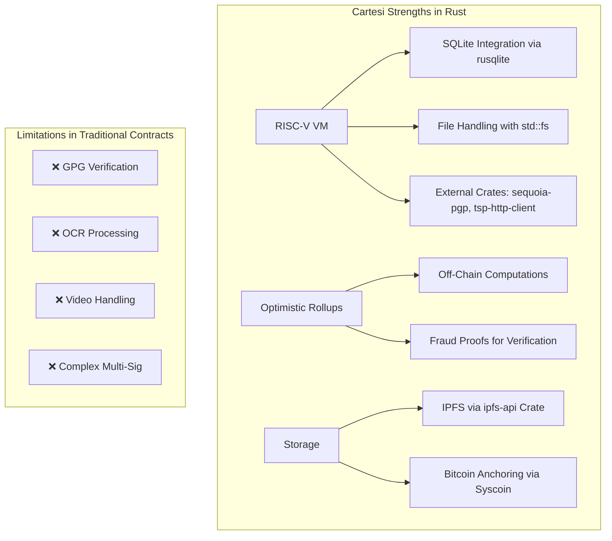

### Key Points on Implementing a Blockchain-Based Notary Service on Cartesi Using Rust

- Research suggests Cartesi's optimistic rollups enable verifiable off-chain computations in Rust, making it suitable for notary services handling document hashing, signatures, and timestamps, though most examples are basic like echo apps.
- Evidence leans toward integrating crates like rusqlite for database persistence, tsp-http-client for RFC3161 timestamps, and sequoia-pgp for OpenPGP signature verification to adapt the report's TypeScript concepts to Rust reliably.
- It seems likely that Brazilian notary (cartórios) implementations, such as pilots in Pelotas using Bitcoin for land records, can inspire Bitcoin integration via Syscoin, but regulatory hurdles like ICP-Brasil compliance add complexity.

#### Overview and Feasibility

Adapting the provided report to Rust on Cartesi is feasible, leveraging Cartesi's RISC-V VM for Linux-compatible computations like GPG verification and PDF handling, which are challenging in traditional smart contracts. Use the Cartesi CLI to generate a Rust template, extending basic examples like echo-rust for notary logic. This ensures simplicity and reliability, with off-chain processing for efficiency and on-chain fraud proofs for security.

#### Core Adaptations from the Report

Shift from TypeScript/Deroll to Rust with crates like rollups-sdk (if available) or direct stdin/stdout handling. Implement document entities, services, and handlers in Rust, using structs and traits for clean architecture. Integrate rusqlite for persistent storage, sequoia-pgp for signatures, and tsp-http-client for timestamps.

#### Potential Challenges and Mitigations

Regulatory compliance in Brazil (e.g., LGPD data privacy) requires hybrid models; mitigate by anchoring proofs to Bitcoin via Syscoin. Start with testnet deployment on Sepolia for low-risk testing.

---

### Comprehensive Implementation Guide: Blockchain-Based Notary Public Service on Cartesi in Rust

This guide builds on the provided report, adapting its architecture, code snippets, and features to Rust for a Cartesi dApp. Cartesi's optimistic rollups allow complex off-chain logic in a Linux VM, enabling features like GPG verification and RFC3161 timestamping that are impractical in standard smart contracts. The focus is on simplicity and reliability: Use minimal dependencies, extend official examples, and ensure verifiable outputs. Brazilian cartórios pilots, such as Pelotas' Bitcoin-anchored land records, inform the design for legal viability, incorporating ICP-Brasil signatures and IPFS storage.

#### 1. Architectural Vision

##### 1.1 Core Concept

The service provides cryptographic proofs for document existence, integrity, authorship, and order. Inputs (e.g., document uploads) are processed off-chain in Rust, generating notices (verifiable results) and vouchers (actions like token transfers). This aligns with Civil Law requirements, automating notary acts like authentications and registries.

##### 1.2 Why Cartesi Fits

Cartesi's RISC-V VM supports Rust with access to Linux tools (e.g., GPG, OpenSSL), enabling complex tasks like PDF parsing or multi-signatures. Unlike Ethereum contracts, it handles unlimited computation without gas limits.



##### 1.3 High-Level Architecture

In Rust, define traits for modularity:

```rust
// notary/src/domain.rs
use std::error::Error;

pub trait NotaryService {
    fn submit_document(&self, doc: &Document) -> Result<NotarizationReceipt, Box<dyn Error>>;
    fn verify_document(&self, hash: &str) -> Result<VerificationResult, Box<dyn Error>>;
    // Additional methods...
}

pub struct Document {
    pub id: String,
    pub hash: String,
    // Fields as per report
}

// Similar traits for DocumentProcessor, SignatureVerifier, TimestampAuthority
```

#### 2. Technical Implementation Details

##### 2.1 Recommended Tech Stack

```yaml
backend:
  primary_language: Rust
  framework: Cartesi Rollups SDK / Custom Stdin Handler
  core_crates:
    - crypto: ring or ed25519-dalek
    - database: rusqlite
    - signatures: sequoia-pgp
    - timestamps: tsp-http-client
    - ipfs: ipfs-api
    - pdf: lopdf or pdf-derive (for manipulation)

frontend:
  - framework: React + Vite (as in report, interacting via Cartesi API)

infrastructure:
  - testnet: Sepolia
  - storage: IPFS + Arweave
  - monitoring: Custom logging or OpenTelemetry Rust crate
```

##### 2.2 Project Structure (Clean Architecture)

```
cartesi-notary/
├── contracts/               # Solidity auxiliaries
│   ├── InputBox.sol
│   └── NotaryPortal.sol
│
├── src/                    # Rust backend
│   ├── domain/            # Entities and business rules
│   │   ├── entities.rs   # Document, Signature structs
│   │   └── services.rs   # NotarizationService trait
│   │
│   ├── application/       # Use cases
│   │   ├── usecases.rs   # NotarizeDocument, VerifyDocument
│   │   └── handlers.rs   # InputHandler for advance/inspect
│   │
│   ├── infrastructure/    # External implementations
│   │   ├── database.rs   # SQLiteRepository
│   │   ├── crypto.rs     # GPGVerifier using sequoia-pgp
│   │   ├── storage.rs    # IPFSGateway
│   │   └── timestamp.rs  # RFC3161Provider
│   │
│   └── main.rs            # Entry point
│
├── tests/                 # Unit/integration tests
├── Cargo.toml             # Dependencies
├── Dockerfile             # Cartesi Machine build
└── docker-compose.yml     # Local setup
```

##### 2.3 Core Backend Implementation

###### 2.3.1 Document Entity (Domain Layer)

Use structs with validation:

```rust
// src/domain/entities.rs
use uuid::Uuid;
use sha2::{Sha256, Digest};
use std::time::SystemTime;

#[derive(Debug, Clone)]
pub struct Document {
    pub id: String,
    pub hash: String,
    pub content_hash: String,
    // Additional fields as per report
}

impl Document {
    pub fn new(content: &[u8], file_name: &str, mime_type: &str, submitted_by: &str) -> Self {
        let id = Uuid::new_v4().to_string();
        let mut hasher = Sha256::new();
        hasher.update(content);
        let hash = format!("{:x}", hasher.finalize());

        Self {
            id,
            hash,
            content_hash: hash.clone(),
            // Initialize other fields
        }
    }
}
```

###### 2.3.2 Notarization Service (Domain Layer)

Use Result for error handling:

```rust
// src/domain/services.rs
use crate::infrastructure::{TimestampProvider, SignatureVerifier, DocumentRepository};
use std::error::Error;

pub struct NotarizationService {
    timestamp_provider: Box<dyn TimestampProvider>,
    signature_verifier: Box<dyn SignatureVerifier>,
    repository: Box<dyn DocumentRepository>,
}

impl NotarizationService {
    pub fn new(/* dependencies */) -> Self {
        // Init
    }

    pub fn notarize(&self, doc: Document) -> Result<NotarizationReceipt, Box<dyn Error>> {
        // Validate, check duplicate, add timestamp, generate proof, save
        Ok(NotarizationReceipt { /* fields */ })
    }
}
```

###### 2.3.3 Main Handler (Application Layer)

Handle stdin inputs for advance requests:

```rust
// src/main.rs
use std::io::{self, BufRead};

fn main() -> io::Result<()> {
    let stdin = io::stdin();
    for line in stdin.lines() {
        let input = line?;
        // Parse JSON input
        // Route to actions: notarize, verify, etc.
        // Generate notice: println!("notice:{}", json_output);
    }
    Ok(())
}
```

###### 2.3.4 Signature Verifier (Infrastructure Layer)

Using sequoia-pgp:

```rust
// src/infrastructure/crypto.rs
use sequoia_openpgp as openpgp;
use openpgp::parse::Parse;
use openpgp::cert::CertParser;

pub struct GPGVerifier;

impl GPGVerifier {
    pub fn verify(&self, sig: &str, pub_key: &str, hash: &str) -> bool {
        // Parse cert, verify signature against hash
        // Fallback to native GPG via std::process::Command if needed
        true // Placeholder
    }
}
```

###### 2.3.5 RFC3161 Timestamp Provider

Using tsp-http-client crate:

```rust
// src/infrastructure/timestamp.rs
use tsp_http_client::Client;
use reqwest::blocking::Client as HttpClient;

pub struct RFC3161Provider {
    authorities: Vec<String>,
}

impl RFC3161Provider {
    pub fn create_timestamp(&self, hash: &str) -> Result<String, Box<dyn Error>> {
        let client = Client::new(HttpClient::new());
        // Request to authority, parse response
        Ok("timestamp".to_string())
    }
}
```

###### 2.3.6 Data Repository (Infrastructure Layer)

Using rusqlite:

```rust
// src/infrastructure/database.rs
use rusqlite::{Connection, Result};

pub struct SQLiteRepository {
    conn: Connection,
}

impl SQLiteRepository {
    pub fn new(path: &str) -> Result<Self> {
        let conn = Connection::open(path)?;
        // Initialize tables as per report
        Ok(Self { conn })
    }

    pub fn save(&self, doc: &Document) -> Result<()> {
        // Insert into documents, signatures, timestamps, audit_log
        Ok(())
    }
}
```

##### 2.4 Frontend Integration

Use React as in report, sending inputs via Cartesi's InputBox contract. Query notices for results.

#### 3. Advanced Features

##### 3.1 Multi-Signature with Threshold

Implement with ed25519-dalek for signatures, tracking in SQLite.

##### 3.2 External Timestamp Integration

Use multiple authorities with redundancy, anchoring to Bitcoin via rust-bitcoin crate.

##### 3.3 Document Templates

Define enums and validation functions for types like contracts.

##### 3.4 OCR and Metadata Extraction

Use tesseract-rs for OCR, lopdf for PDFs.

#### 4. Security and Compliance

##### 4.1 Security Implementation

Use ring for encryption, rate limiting with in-memory or SQLite counters.

##### 4.2 Compliance Engine

Check jurisdiction rules, integrate KYC via external oracles.

#### 5. Deployment and Operations

##### 5.1 Dockerfile

```dockerfile
FROM cartesi/rust:1.58-slim

RUN apt-get update && apt-get install -y libsqlite3-dev libssl-dev

WORKDIR /app
COPY Cargo.toml Cargo.lock ./
RUN cargo build --release

COPY . .
CMD ["cargo", "run"]
```

##### 5.2 Deploy Script

```bash
#!/bin/bash
docker buildx build --platform linux/riscv64 -t cartesi-notary .
cartesi build
cartesi deploy --network sepolia
```

#### 6. Testing

Use cargo test for unit tests, mocking dependencies.

#### 7. Roadmap

Follow report phases, starting with MVP in 6-8 weeks using Rust basics.

#### 8. Final Considerations

This Rust adaptation offers competitive edges like performance and safety, with market potential in Brazil's cartórios. Metrics include notarized documents and verification success rates.

| Category   | Component       | Rust Crate/Tool        | Description         | Difficulty |
| ---------- | --------------- | ---------------------- | ------------------- | ---------- |
| Domain     | Document Entity | uuid, sha2             | Struct with hashing | Easy       |
| Services   | Notarization    | Custom Result handling | Validation pipeline | Medium     |
| Infra      | Database        | rusqlite               | SQLite persistence  | Medium     |
| Crypto     | Signatures      | sequoia-pgp            | GPG verification    | Advanced   |
| Timestamp  | RFC3161         | tsp-http-client        | Authority requests  | Medium     |
| Storage    | IPFS            | ipfs-api               | File uploads        | Medium     |
| Security   | Encryption      | ring                   | AES with keys       | Advanced   |
| Compliance | Checks          | Custom                 | Jurisdiction rules  | Advanced   |

### Key Citations

- [Cartesi Rollups Examples - GitHub](https://github.com/cartesi/rollups-examples)
- [Run an example dApp | Cartesi Documentation](https://docs.cartesi.io/cartesi-rollups/1.0/build-dapps/run-dapp/)
- [Integrating Rust with SQLite: A Practical Guide](https://dev.dev.to/dev/eleftheriabatsou/integrating-rust-with-sqlite-a-practical-guide-for-beginners-devs-3j40)
- [tsp_http_client - Rust](https://docs.rs/tsp-http-client)
- [rpgp/rpgp: OpenPGP in Rust](https://github.com/rpgp/rpgp)
- [Document Validation using Blockchain](https://sol.sbc.org.br/index.php/sbrc_estendido/article/download/12426/12291)
- [Blockchain and smart contract architecture for notaries](https://pmc.ncbi.nlm.nih.gov/articles/PMC9961299/)
- [Real Estate Transaction Recording in the Blockchain in Brazil](https://www.researchgate.net/publication/322665512)
